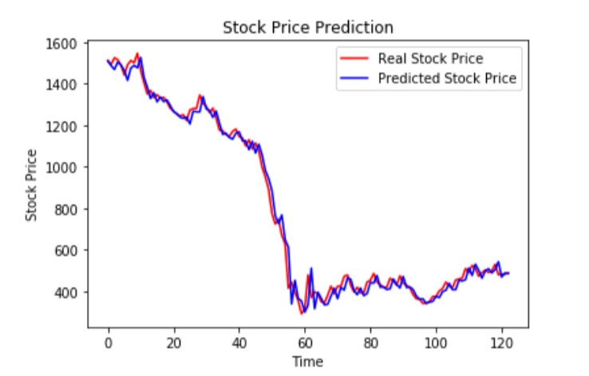

# Stock Prices Trend Prediction using LSTM
I am using Recurrent Neural Networks(LSTMs to be precise) to predict stock prices, which in recent times have shown excellent results in time-series forcasting. Stock Price Prediction using RNN is a process of predicting the trend of stock prices whether the market is showing an upward trend or downward. 

The project can be used to guess whether it is a good time to invest money in a particular firm or not. If there is a start in upward trend, one should consider investing in that firm but if the trend is beginning to decline, one should avoid investing in that firm.

Although stock prices are affected by a lot of Factors that cannot be predicted like Economic conditions, Political factors, Natural calamities etc. but still the model shows a robust performance and can be used on any type of share dataset to predict the trend.  

# Data
We used Nifty shares dataset till June 30th, 2020 from [here](https://www.kaggle.com/rohanrao/nifty50-stock-market-data?select=INDUSINDBK.csv)

# Requirements
Python 3.7

Keras 2.3

Numpy 1.18

Pandas 1.0

Matplotlib 3.1

# Result

# References
[The Unreasonable Effectiveness of Recurrent Neural Networks](http://karpathy.github.io/2015/05/21/rnn-effectiveness/), Andrej Karpathy

[Understanding LSTM Networks](https://colah.github.io/posts/2015-08-Understanding-LSTMs/), Christopher Olah

[Deep Sequence Modeling](https://www.youtube.com/watch?v=SEnXr6v2ifU&list=PLtBw6njQRU-rwp5__7C0oIVt26ZgjG9NI&index=2), MIT 6.S191 Introduction to
Deep Learning

[Sequence Modeling: Recurrentand Recursive Nets](https://www.deeplearningbook.org/contents/rnn.html), Deep Learning Ian Goodfellow Yoshua Bengio Aaron Courville
